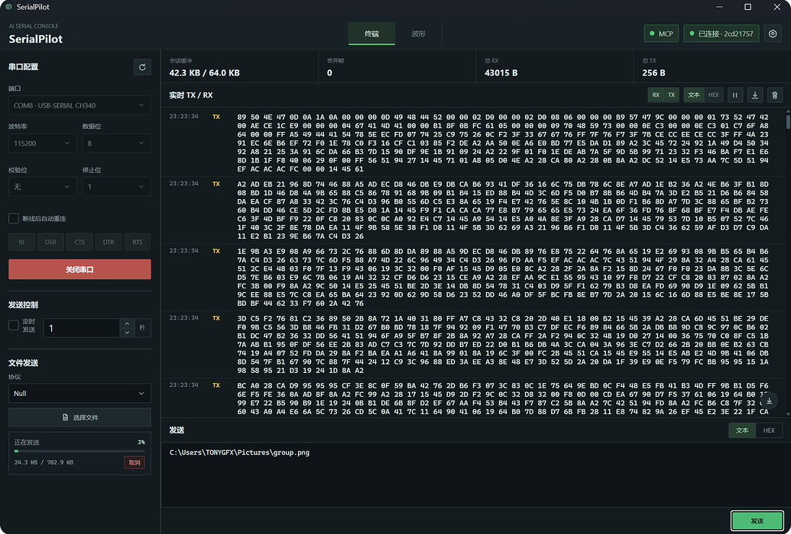
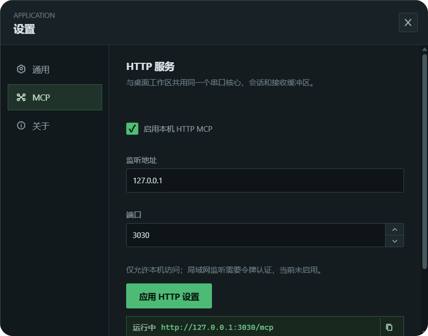
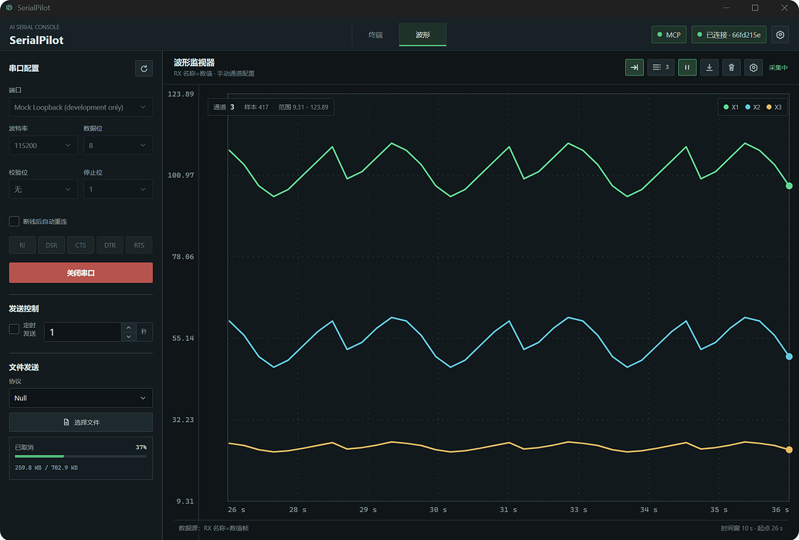

<p align="center">
  
</p>

<h1 align="center">SerialPilot</h1>

<p align="center">跨平台桌面端 AI 串口助手</p>

<p align="center">
  <a href="https://github.com/TONYGFX/SerialPilot">GitHub</a>
  ·
  <a href="LICENSE">MIT License</a>
</p>

SerialPilot 面向嵌入式开发、硬件调试和串口自动化场景。它将可靠的 Rust 串口核心、专业桌面工作区和 MCP 工具接口组合在一起，让用户和 AI 都通过同一套结构化命令操作串口。

## 产品特点

- 原生桌面工作区：可调整大小的配置栏、终端日志区和波形工作区，窗口变化时自动填充客户区。
- 可靠串口核心：后台持续接收、固定容量 RX 缓冲、游标读取、超时等待和请求-响应事务。
- 完整数据保留：发送和接收均保留原始字节，同时提供文本、HEX 和 Base64 数据处理。
- 可选文本编码：终端文本收发、文本匹配和波形解析支持 UTF-8、GBK、ASCII、UTF-16LE；HEX 始终显示原始字节。
- 多通道波形：自定义通道名称和颜色，支持跟随最新数据、拖拽平移、横轴缩放和悬浮查看采样值。
- **文件传输**：Null 原始流发送，以及 Xmodem、Xmodem-1k、Ymodem 的可靠收发；支持 CRC/checksum 握手、最多 10 次重传、进度、取消与接收文件定位。
- **AI 原生控制**：MCP 通过结构化工具完成端口枚举、参数配置、发送、持续接收、请求-响应事务和波形通道管理，AI 不需要截图、视觉识别或模拟点击界面。
- 深色、浅色和跟随系统主题。

## 重点能力

### 文件传输

SerialPilot 将文件传输作为串口调试工作区的一部分，而不是额外的脚本工具。用户可以选择文件和协议，也可以切换为接收模式；传输进度、当前状态和取消操作都保留在同一个面板中，完成后的接收记录可直接定位到文件所在目录。

| 协议 | 发送 | 接收 | 说明 |
| --- | --- | --- | --- |
| Null | 支持 | 不支持 | 原始字节流没有文件名、长度和结束边界，无法可靠恢复为一个文件。 |
| Xmodem | 支持 | 支持 | 自动兼容 CRC 与 checksum 握手，校验失败或 NAK 时最多重传 10 次。 |
| Xmodem-1k | 支持 | 支持 | 使用 1 KiB CRC 数据包，校验失败或 NAK 时最多重传 10 次。 |
| Ymodem | 支持 | 支持 | 使用 CRC、文件名和长度元数据，完成时发送标准结束包；当前界面一次传输一个文件。 |



### MCP AI 控制

SerialPilot 的 MCP 是 AI 操作串口的唯一控制接口。MCP 与 UI 共用同一个 Rust 串口核心和 Command/Event 路径，因此 AI 执行的打开、配置、发送、读取和波形操作，会与用户操作一样产生 TX/RX 数据、状态事件和可审计结果。

MCP 支持 stdio 和 Streamable HTTP 两种连接方式，适合接入本地 AI 客户端或需要 HTTP 接入的自动化服务。所有接收工具都是有界的，支持游标、超时和匹配条件，不会通过无限等待阻塞 AI 工作流。



## 波形绘制

SerialPilot 的波形监视器用于把串口接收的命名数值帧转换为多通道曲线。它只解析已经进入串口核心接收缓冲区的 RX 数据，原始字节、终端日志和波形样本彼此独立，调整通道或图表不会破坏原始串口记录。

### 数据格式

波形解析使用简单、稳定的 `名称=数值` 格式。一个 RX 文本帧可以包含多个以英文逗号分隔的字段，并以 `CRLF`（`\r\n`）结尾，例如：

```text
X1=12.4,X2=0.82,X3=26.5\r\n
```

在通道配置中填写的名称必须与帧中的字段名称完全一致。数值支持整数、负数和小数；无法转换为数值的字段会被忽略，未配置的字段不会自动生成通道。波形监视器只处理 RX 帧，不会把 TX 数据绘制到曲线上。

### 使用流程

1. 打开串口并确认设备正在输出命名数值帧。
2. 切换到“波形”工作区，在通道配置中添加通道，填写名称、选择线条颜色并启用通道。
3. 点击开始监视。监视默认关闭，开始时会从新的采样序列开始接收匹配数据。
4. 当 RX 帧中的名称与通道匹配时，样本会进入对应曲线；同一帧可以同时更新多个通道。
5. 使用工具栏的清空、保存和通道设置操作管理当前波形数据。

### 图表操作

- 横轴是相对时间，当前采集序列的第一条样本为 `0 ms`。
- 默认启用“跟随最新数据”，新样本到达时视图自动保持在曲线尾部。
- 鼠标左键拖动可以平移曲线；滚轮可以沿时间轴移动，按住 `Shift` 可使用滚轮进行横向平移。
- 按住 `Ctrl` 滚动可以缩放横向时间刻度，缩放以鼠标位置为锚点；按 `Ctrl+0` 可恢复默认的 10 秒时间窗。
- 鼠标悬浮在采样点附近会显示通道名称、数值、相对时间和对应的串口游标。
- 纵轴根据当前可见样本自动计算范围，并为曲线保留边距；不同通道共用同一组纵轴刻度，便于对比。
- 点击跳转到最新数据按钮可以恢复自动跟随；手动拖动或滚动查看历史数据时会暂时退出跟随模式。

### 保存与数据上限

点击保存会生成默认名称为 `SerialPilot_Waveform_YYYYMMDD_HHMMSS.txt` 的文本文件。文件使用制表符分隔，包含以下列：

```text
relative_time_ms    absolute_time    channel    value
```

波形界面最多保留最近 `1800` 个解析样本用于绘制，串口核心中的原始 RX 缓冲和终端日志不受这个显示上限影响。清空波形只清除当前派生样本，不会删除串口核心已经记录的原始帧。




## 架构

```text
React UI ─┐
MCP      ─┼─> 统一 Command / Event ─> Rust SerialCore ─> SerialAdapter ─> 串口设备
审计记录 ─┘
```

- 前端不直接访问物理串口。
- MCP 不绕过串口核心访问硬件。
- 只有 Rust 串口适配器可以访问物理串口。
- 串口打开后，后台读取任务持续运行；`read_since`、`wait_for` 和 `exchange` 从接收缓冲区读取数据。
- 原始字节、文本显示和波形解析结果分开保存，解析不会覆盖原始数据。
- stdio MCP 的协议消息写入 stdout，诊断日志写入 stderr。

## MCP

SerialPilot 支持两种 MCP 连接方式：

- **stdio**：由 MCP 客户端启动 `serialpilot-mcp`，适合本地桌面 AI 客户端。
- **Streamable HTTP**：启动 `serialpilot-mcp-http`，或在桌面程序设置中启用本机 HTTP 服务。

桌面程序内置 HTTP 服务默认使用：

```text
http://127.0.0.1:3030/mcp
```

核心工具包括：

- 串口：`serial.list_ports`、`serial.open`、`serial.configure`、`serial.status`、`serial.send`
- 接收：`serial.read_since`、`serial.wait_for`、`serial.exchange`
- 批量和连接：`serial.send_batch`、`serial.exchange_batch`、`serial.wait_for_any`、`serial.monitor_ports`、`serial.reconnect`
- 波形：`waveform.list_channels`、`waveform.add_channel`、`waveform.update_channel`、`waveform.remove_channel`、`waveform.clear_samples`

当前 HTTP 实现使用 Streamable HTTP，不使用 SSE；SSE/实时事件流仅用于桌面端内部状态同步。

### 文本编码

在“设置 -> 通用 -> 文本编码”中选择 `UTF-8`（默认）、`GBK`、`ASCII` 或 `UTF-16LE`。该选择同时用于终端文本显示、文本发送、波形的命名数值帧解析和桌面端定时发送；切换编码会重新解释已记录的原始字节，不会改写或清空串口记录。主界面保持“文本 / HEX”两种数据格式，其中 HEX 始终按字节显示。

MCP 的 `serial.send`、`serial.exchange` 及批量请求可选传入 `text_charset`；`serial.wait_for` 的 `condition.text_charset` 决定 `contains_text` 的匹配编码。未传入时保持兼容，默认使用 `utf-8`。

```json
{
  "session_id": "<session_id>",
  "encoding": "text",
  "text_charset": "gbk",
  "payload": "设备测试"
}
```

## 下载与运行

Windows 用户下载发布页中的 `serialpilot.exe` 即可运行。`serialpilot-mcp.exe` 和 `serialpilot-mcp-http.exe` 是给需要独立 MCP 服务的用户使用的辅助程序，不是桌面 UI。

当前版本：**v0.1.3**

## 从源码运行

开发环境需要：

- Node.js 20+
- Rust stable 和 Cargo
- Windows WebView2 与 Tauri 2 构建依赖

```bash
npm install
npm run tauri dev
```

常用验证命令：

```bash
npm run build
npm test -- --run
cargo fmt --manifest-path src-tauri/Cargo.toml -- --check
cargo test --manifest-path src-tauri/Cargo.toml
```

## 项目结构

```text
src/                 React、TypeScript 界面与前端状态投影
src-tauri/src/       Rust 串口核心、命令、事件和 MCP 服务
src-tauri/src/serial/  串口适配器，包括真实适配器和测试 Mock
docs/                发布说明与架构文档
tests/               自动化测试（按模块放置在 src/ 与 Rust 模块旁）
```

## 已知限制

- 不同操作系统和设备驱动对串口控制线、独占访问等能力的支持可能不同。
- 本地会话审计目前主要保留在内存中，SQLite 持久化将在后续版本完善。
- Mock 适配器仅用于开发和自动化测试，不进入正常发行版运行路径。

## 友链

**LinuxDo** — [https://linux.do](https://linux.do/)

## License

本项目采用 [MIT License](LICENSE) 协议开源。

Copyright (c) 2026 TONYGFX
